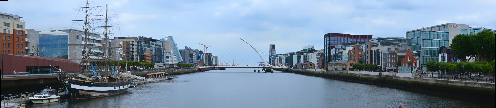
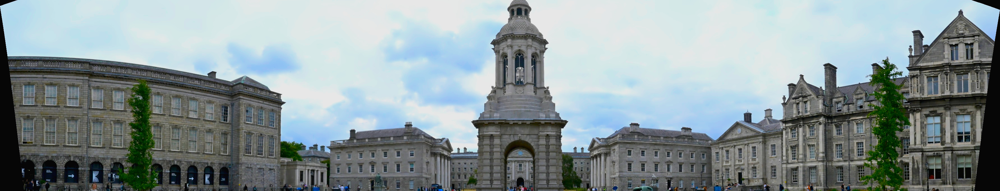
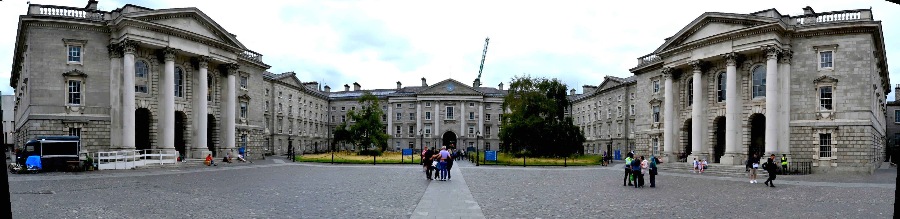

# Mill's Panorama Generator

## Some examples:
<figure>
	
	<figcaption align="center"><i>Samuel Beckett Bridge, Dublin</i></figcaption>
</figure>

<figure>
	
	<figcaption align="center"><i>Trinity College Dublin Front Square</i></figcaption>
</figure>

<figure>
	
	<figcaption align="center"><i>Trinity College Dublin Front Square, Again</i></figcaption>
</figure>

A small, cross-platform panorama stitching tool using OpenCV's Stitcher and C++17 `std::filesystem`.

## Features
- Loads all images from an input directory (assumed left-to-right order by filename).
- Validates inputs/outputs with `std::filesystem`; creates output directory if missing.
- Converts .HEIC/.HEIF images to .jpg automatically before stitching (requires OpenCV with HEIF support).
- Uses OpenCV Stitcher (PANORAMA mode). If only one image is provided, copies it to the output.
- Command-line interface for input dir, output dir, and output filename.

## Project structure
root/ \\
|-- build/ \\
|-- images/ \\
|-- include/ \\
|-- media/ \\
|-- output/ \\
|-- src/ \\
|-- main.cpp \\
|-- .gitignore \\
|-- Makefile \\
\-- CMakeLists.txt

## Requirements
- C++17 compiler
- CMake 3.14+
- OpenCV 4.x installed and discoverable by CMake (e.g., via pkg-config or config files)

## Build
```
make release
```
This runs CMake and builds into the `build/` folder.

Alternatively:
```
cmake -S . -B build -DCMAKE_BUILD_TYPE=Release
cmake --build build --config Release
```

## Run
Place your ordered images in `images/` (or specify another directory), then:
```
./build/panorama -i images -o output -f panorama.jpg
```
Options:
- `-i, --input <dir>`: Input images directory (default: `./images`)
- `-o, --output <dir>`: Output directory (default: `./output`)
- `-f, --file <name>`: Output filename (default: `panorama.jpg`)
- `-h, --help`: Show help

## Notes
- The tool expects neighboring images to have sufficient overlap and be approximately left-to-right.
- OpenCV's Stitcher chooses features/matchers internally based on your build (SIFT/ORB, etc.).
- If stitching fails, try reducing image sizes or ensuring more overlap.
