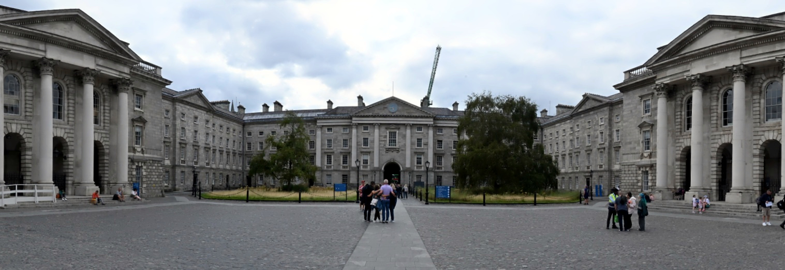

# Mill's Panorama Generator
A small, cross-platform panorama stitching tool to cure my unemployment boredom and make myself a LinkedIn background. It's written in C++17 using OpenCV 4.12 (any OpenCV 4.X should work fine).

## Some examples:
Can definitely do a bit of editing here to make them prettier. Also, don't aim up as much as I did. Keep the camera as horizontal as possible for best results. Would also recommend choosing a nicer day than I did but this is Dublin so beggars can't be choosers.
<figure>
	<figcaption align="center"><i>Samuel Beckett Bridge, Dublin</i></figcaption>
	
</figure>

<figure>
	<figcaption align="center"><i>Trinity College Dublin Front Square</i></figcaption>
	
</figure>

<figure>
	<figcaption align="center"><i>Trinity College Dublin Front Square, Again</i></figcaption>
	
</figure>

## Features
- Loads all images from an input directory (assumed left-to-right order by filename).
- Validates inputs/outputs with `std::filesystem`; creates output directory if missing.
- Converts .HEIC/.HEIF images to .jpg automatically before stitching (requires OpenCV with HEIF support).
- Wraps `cv::Stitcher` in PANORAMA mode.
- Trims black bands at the top/bottom of the final panorama.
- Adaptive low-memory path: for very large panoramas, automatically downsizes the canvas and uses a memory-friendly Feather blender to avoid OOM.
- Command-line interface for input dir, output dir, output filename, and tuning flags.

## Project structure
```
Panorama/
├── build/
├── images/
├── include/
├── media/
├── output/
├── src/
├── main.cpp
├── .gitignore
├── Makefile
└── CMakeLists.txt
```

## Requirements
- C++17 compiler
- CMake 3.14+
- OpenCV 4.x installed and discoverable by CMake (e.g., via pkg-config or config files)

## Build
```
make release
```
This runs CMake and builds into the `build/` folder.

Alternatively:
```
cmake -S . -B build -DCMAKE_BUILD_TYPE=Release
cmake --build build --config Release
```

## Run
Place your ordered images in `images/` (or specify another directory), then:
```
./build/panorama -i images -o output -f panorama.jpg
```
Options:
- `-i, --input <dir>`: Input images directory (default: `./images`)
- `-o, --output <dir>`: Output directory (default: `./output`)
- `-f, --file <name>`: Output filename (default: `panorama.jpg`)
- `--top-match-only`: Match only the top half (helps avoid moving crowds/cars)
- `--max-dim N`: Downscale inputs so max(width,height) <= N before stitching (0 disables; default: 2000)
- `-h, --help`: Show help

Examples:
- Default stitch with top-half matching:
	```
	./build/panorama --top-match-only -i images/tcd_front_square_3 -o output/tcd_3 -f top_half.jpg
	```
- Increase input size limit for higher detail (uses more memory/CPU):
	```
	./build/panorama --max-dim 1000 -i images/myset -o output -f hires.jpg
	```

## Notes
- The tool expects neighboring images to have sufficient overlap and be approximately left-to-right by filename.
- If you see ghosting from people or cars, try `--top-match-only`.
- If you hit memory limits on large sets, keep `--max-dim` at the default or lower it; for huge panoramas the tool also auto-switches to a low-memory blending path.
- OpenCV's Stitcher chooses features/matchers internally based on your build (SIFT/ORB, etc.).
- If stitching fails, try reducing image sizes or ensuring more overlap.
